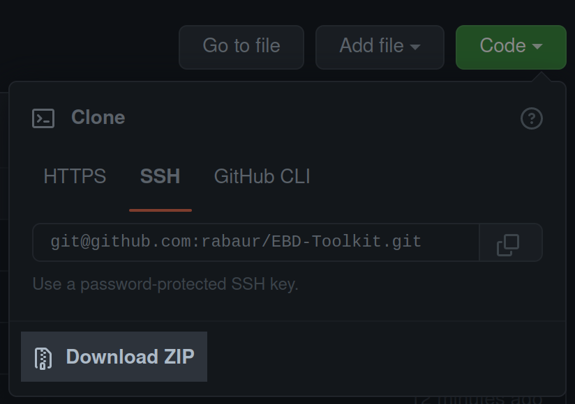
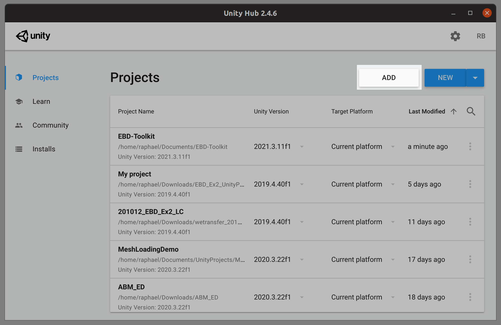
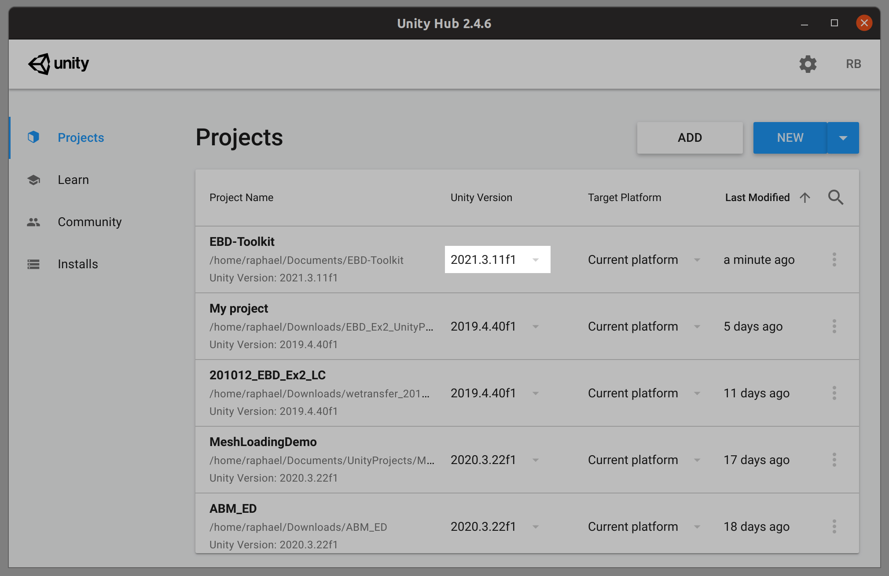

# EBD-Toolkit

**Unity Version**: 2021.3.11f1

## How to run

* Download the project as a .zip file
    
* Unzip the folder
* Add the folder as a Unity Project project by selecting in Unity Hub:
    
* Choose Unity 2021.3.11f1 (or newer). Install if not present:
    
